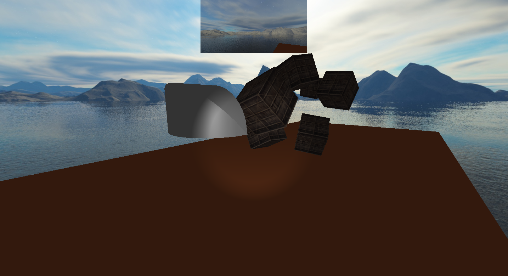

# tmig

3D Graphics rendering engine with OpenGL and C++

## Running

`NOTE`: The project currently is (probably) not compatible with Windows; only Linux.

Build the project:

```bash
cmake .
make
```

All tests will be placed under /tests/bin, so you can just execute them:

```bash
./tests/bin/scene_test
```

## Screenshots

Base scene with a rotating Torus (donut) inside a box with some colored lights:


Scene with a skybox, some textured boxes and a spotlight in the direction of the camera, acting as a flashlight (also the rear-view mirror at the top):



Stress test with 1 million colored boxes using the `Instanced Rendering` technique, running at 60 FPS:


## What's next

The plan is to incorporate physics simulation into the engine so it becomes more of a Game Engine, rather than just a Rendering Engine.

There are some structures for Rigid Bodies and collision detection already implemented, but they're not ready for use yet. There is also a rigid_body test scene, but it's very primitive and is missing collision handling.